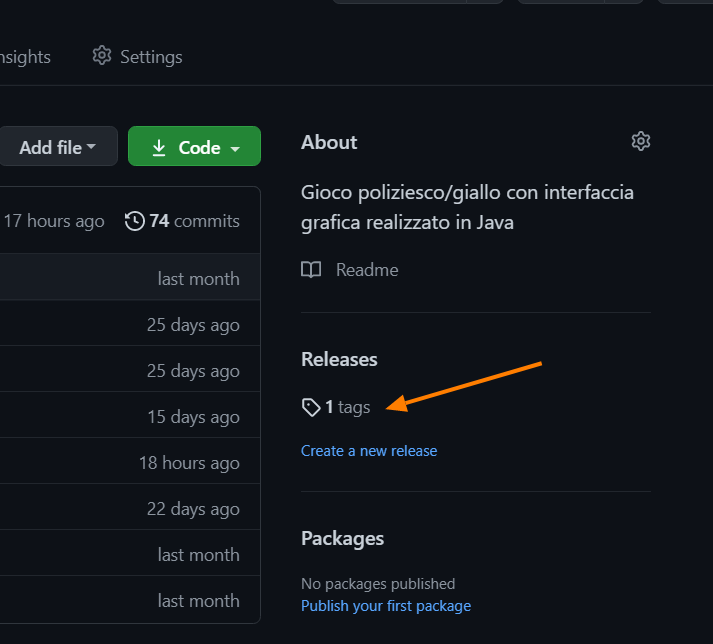
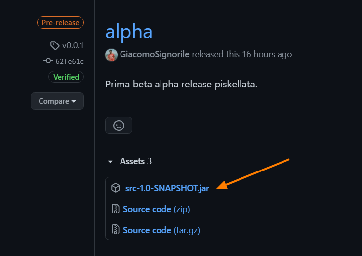
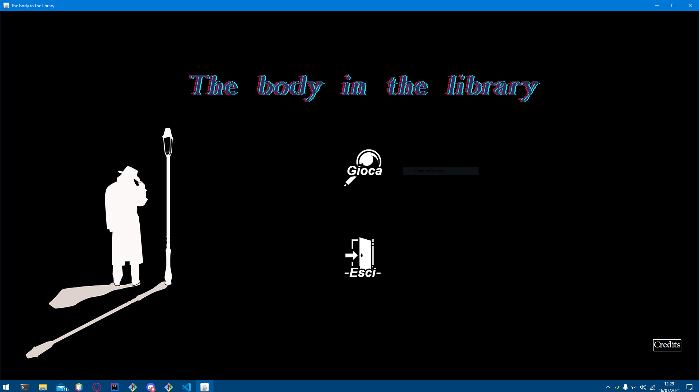

# The body in the library

[](http://commonmark.org)
[](https://GitHub.com/burraco135/map2021/issues/)
[](https://GitHub.com/burraco135/map2021/issues?q=is%3Aissue+is%3Aclosed)
[](https://github.com/Naereen/badges/)

## Indice
1. [Struttura repository](#struttura-repository)
2. [Introduzione](#introduzione)
3. [Guida per l'utilizzo](#guida-per-lutilizzo)
4. [Guida per l'utente](#guida-per-lutente)
5. [Personaggi](#personaggi)
6. [Mappe](#mappe)
7. [Soluzione](#soluzione)
8. [Dettagli implementativi e tecnologie utilizzate](#dettagli-implementativi-e-tecnologie-utilizzate)
9. [Specifica algebrica di una struttura dati utilizzata](#specifica-algebrica-di-una-struttura-dati-utilizzata)
10. [Architettura del sistema e diagramma UML delle classi](#architettura-del-sistema-e-diagramma-uml-delle-classi)
11. [Report](#report)

## Struttura repository
La struttura della repository si presenta nel seguente modo:
```
|-- .github
|   |-- workflows
|   |   |-- blank.yml
|-- doc
|   |-- drawings
|   |-- javadoc
|   |-- storyboard
|   |-- Mappe.pdf
|   |-- Report.md
|-- srcgame
|   |-- src
|   |   |-- main
|   |   |   |-- java
|   |   |   |   |-- db
|   |   |   |   |-- game
|   |   |   |   |-- type
|   |   |   |-- resources
|   |   |-- test
|   |-- pom.xml
|   |-- src.iml
|   |-- srcgame.iml
|-- .gitignore
|-- README.md
```

## Introduzione
Il gioco si ispira a <i>C'è un cadavere in biblioteca</i> di [Agatha Christie](https://it.wikipedia.org/wiki/Agatha_Christie),
rivisitato in modo da offrire una
esperienza di gioco il più vicino possibile ad una avventura testuale, senza perdere il fascino di un giallo scritto
dalla regina del crimine.

La famiglia Bantry viene svegliata da una cameriera che ha appena rinvenuto il cadavere di una giovane sconosciuta nella
biblioteca della loro casa, Gossington Hall, nel suggestivo sud-est dell'Inghilterra.<br>
Sul posto arriva subito l'Ispettore Slack. Riuscirai a risolvere il caso ed arrestare l'artefice di questa bizzarra storia?

Sono presenti 2 scenari per risolvere il caso:
- **Gossington Hall**, la villa della famiglia Bantry e il luogo in cui viene rinvenuto il cadavere;
- **Majestic Hotel**, hotel della contea vicina al luogo del delitto.

Un piccolo indizio da parte della simpatica Miss Marple:

> Non ci si può permettere di credere in tutto ciò che dice la gente.

[Torna su](#indice)

## Guida per l'utilizzo
Per giocare occorre cliccare su **tags**<br>


Successivamente, cliccare su **Assets** e dopo sul file <code>src-1.0-SNAPSHOT.jar</code><br>


A questo punto inizierà il download del gioco. Basta solo fare doppio click sul file appena scaricato per farlo avviare. La scena iniziale del gioco è la seguente:<br>


> Attenzione! Occorre avere Java installato sulla macchina per poterlo aprire.<br>
> Puoi verificare se Java è installato inserendo il comando <code>java -version</code>.<br>
> Per questo programma è necessario [Java 8](https://www.java.com/it/download/help/java8_it.html) o superiore.<br>

[Torna su](#indice)

## Guida per l'utente
Il gioco si apre con le riflessioni dell'Ispettore Slack nella sua berlina.<br>
Allertato dalla polizia della contea, vai a Gossington Hall, la villa in cui è stato rinvenuto il cadavere di una giovane ragazza. Sulla scena del crimine trovi il medico legale, la Dottoressa Haydock<sup>[[1]](#haydock)</sup>, e altre persone. Indaga in ogni stanza della villa per ottenere informazioni e oggetti utili per risolvere il caso.<br>
Quando avrai finito di parlare con tutti e avrai raccolto tutti gli indizi di Gossington Hall, torna nel corridoio all'entrata per poter andare nella prossima location, il Majestic Hotel. Quando avrai raccolto tutti i 6 indizi, torna alla reception dell'hotel per concludere le indagini.

[Torna su](#indice)

## Personaggi
Vedi [Storyboard.md](doc/storyboard/Dettagli_avventura.md)

[Torna su](#indice)

## Mappe
Vedi [Mappe.pdf](doc/Nuove mappe gioco.pdf)

[Torna su](#indice)

## Soluzione
> Attenzione! Warning! Achtung! Attention! Inizio spoiler!

Se vuoi arrivare direttamente al finale del gioco, segui questi comandi:<br>
1. Appena entri in Gossington Hall, vai al piano superiore e vai nella stanza a destra. Parla con la dottoressa Haydock e clicca sull'opzione "Autopsia";
2. Sempre nella biblioteca, clicca sul cadavere posizionato sul divano (è un telo bianco) e scegli l'opzione "Ispeziona" per ottenere l'oggetto "Abito bianco";
3. Torna all'ingresso di Gossington Hall (scendi le scale), e sarà apparso in basso al centro l'icona bianca di un hotel; clicca sull'icona per andare nella prossima location, il Majestic Hotel;
4. Una volta arrivato nell'hotel, vai a sinistra nella Sala da ballo e parla con Josephine Turner e clicca sull'opzione "Ruby Keene"; riceverai un vestito e una unghia (impigliata nel vestito)
5. Vai a sinistra ed entra nella stanza sulla sinistra (clicca sulla porta e non fare il maleducato), parla con Conway Jefferson e clicca sulla opzione "Info su Ruby Keene";
6. Vai a sinistra e vai sulla veranda, sulla sedia del tavolino troverai un plico bianco; scegli l'opzione "Raccogli" per ottenere l'estratto conto di Mark Gaskell.
7. Torna alla reception dell'Hotel per andare alla stazione di polizia (è una icona bianca a destra) e interrogare i colpevoli.

Esistono 3 finali, quello corretto è con Josephine Turner e Mark Gaskell. Se interroghi Basil Blake o Arthur Bantry, verrà mostrata la bad ending e si potrà ripetere l'interrogatorio con gli altri.

> Fine spoiler.

[Torna su](#indice)

## Dettagli implementativi e tecnologie utilizzate
Per conservare tutti i dati relativi ai personaggi, agli oggetti, alle stanze e alle mappe del gioco, è stata utilizzata la JDBC con [**database h2**](https://www.h2database.com/html/main.html). Per verificarne il funzionamento effettivo, il programma effettua diversi test per controllare l'esecuzione della creazione dei dati, il loro inserimento e le query applicate ai dati durante il gioco.<br>
Tutta la parte grafica è stata gestita tramite la libreria [**Swing**](https://it.wikipedia.org/wiki/Swing_(Java)).<br>
Sono stati utilizzati alcuni [**thread**](https://it.wikipedia.org/wiki/Concorrenza_(informatica)) per la musica nel gioco.<br>
Mentre alcune parti testuali sono conservate nel database, i dialoghi sono stati implementati utilizzando dei **file** di testo letti tramite <code>InputStream</code>.

Per approfondire l'argomento, vai in [Report.md](doc/Report.md)

[Torna su](#indice)

## Specifica algebrica di una struttura dati utilizzata
Nel programma è presente la struttura dati **Lista** che ha la seguente specifica algebrica:

### Specifica sintattica
**Tipi**: lista, posizione, boolean, tipoelem

**Operatori**:
- creaLista: () &rightarrow; lista
- listaVuota: (list) &rightarrow; boolean
- leggiLista: (posizione, lista) &rightarrow; tipoelem
- scriviLista: (tipoelem, posizione, lista) &rightarrow; lista
- primoLista: (lista) &rightarrow; posizione
- fineLista: (posizione, lista) &rightarrow; boolean
- succLista: (posizione, lista) &rightarrow; posizione
- predLista: (posizione, lista) &rightarrow; posizione
- insLista: (tipoelem, posizione, lista) &rightarrow; lista
- cancLista: (posizione, lista) &rightarrow; lista

### Specifica semantica
**Tipi**:
- lista: insieme delle sequenze *l = < a<sub>1</sub>, a<sub>2</sub>, ..., a<sub>n<sub> >* con *n &le; 0*, di elementi di tipo tipoelem dove l'elemento *i*-esimo ha valore *a(i)* e posizione *pos(i)*
- boolean: insieme dei valori di verità

**Operatori**:
- creaLista = l'
    - Post: l' = < >
- listaVuota(l) = b
    - Post: 𝑏 = 𝑡𝑟𝑢𝑒 se 𝑙 = < >; 𝑏 = 𝑓𝑎𝑙𝑠𝑒 altrimenti
- leggiLista(p, l) = a
    - Pre:  𝑝 = 𝑝𝑜𝑠(𝑖) con 1 ≤ 𝑖 ≤ n
    - Post: 𝑎 = 𝑎(𝑖)
- scriviLista(a, p, l) = l'
    - Pre: 𝑝 = 𝑝𝑜𝑠(𝑖) con 1 ≤ 𝑖 ≤ n
    - Post: l' = < a<sub>1</sub>, a<sub>2</sub>, ..., a<sub>i-1</sub>, a, a<sub>i+1</sub>, ..., a<sub>n</sub> >
- primoLista(l) = p
    - Pre: listavuota(l) = false
    - Post: p = pos(1)
- fineLista(p, l) = b
    - Pre:  𝑝 = 𝑝𝑜𝑠(𝑖) con 1 ≤ 𝑖 ≤ 𝑛 + 1
    - Post: 𝑏 = 𝑡𝑟𝑢𝑒 se 𝑝 = 𝑝𝑜𝑠(𝑛 + 1); 𝑏 = 𝑓𝑎𝑙𝑠𝑒 altrimenti
- succLista(p, l) = p
    - Pre: 𝑝 = 𝑝𝑜𝑠(𝑖) con 1 ≤ 𝑖 < n
    - Post: 𝑞 = 𝑝𝑜𝑠(𝑖 + 1)
- predLista(p, l) = p
    - Pre:  𝑝 = 𝑝𝑜𝑠(𝑖) con 2 ≤ 𝑖 ≤ n
    - Post:  𝑞 = 𝑝𝑜𝑠(𝑖 − 1)
- insLista(a, p, l) = l'
    - Pre:  𝑝 = 𝑝𝑜𝑠(𝑖) con 1 ≤ 𝑖 ≤ 𝑛 + 1
    - Post: 
        - l' = < a<sub>1</sub>, a<sub>2</sub>, ..., a<sub>i-1</sub>, a, a<sub>i+1</sub>, ..., a<sub>n</sub> > se 1 &le; i &le; n
        - l' = < a<sub>1</sub>, a<sub>2</sub>, ..., a<sub>n</sub>, a > se i = n + 1
        - l' = < a > se i = 1 e l = < >
- cancLista(p, l) = l'
    - Pre: p = pos(i) con 1 &le; i &le; n
    - Post: l' = < a<sub>1</sub>, a<sub>2</sub>, ..., a<sub>i-1</sub>, a<sub>i+1</sub>, ..., a<sub>n</sub> >

| Osservazioni | Costruttore di l' | Costruttore di l' |
|---|---|---|
|  | creaLista() | insLista(a, p, l) |
| listaVuota(l') | true | false |
| leggiLista(p, l') | error | a |
| scriviLista(a, p, l') | l = < a > | l = < a<sub>1</sub>, a<sub>2</sub>, ..., a<sub>i-1</sub>, a<sub>i</sub>, a<sub>i+1</sub>, ..., a<sub>n</sub> > con p = pos(i) |
| primoLista(l') | error | p = pos(1) |
| fineLista(p, l') | error | if p = pos(n) then true else false |
| succLista(p, l') | error | if fineLista(p, l') = true then error else p = pos(i+1) |
| predLista(p, l') | error | if p = primoLista(l') then error else p = pos(i-1) |
| cancLista(p, l') | error | if primoLista(l') = p then l = < > else l = < a<sub>1</sub>, a<sub>2</sub>, ..., a<sub>i-1</sub>, a<sub>i+1</sub>, ..., a<sub>n</sub> > |

[Torna su](#indice)

## Architettura del sistema e diagramma UML delle classi
Vedi [Report.md](doc/Report.md) per le informazioni complete del progetto, oppure fai direttamente alla [sezione](doc/Report.md/#stile-architetturale-adottato).

[Torna su](#indice)

## Report
Vedi [Report.md](doc/Report.md)

[Torna su](#indice)

## Fun fact
### Haydock
La Dottoressa Haydock nella storia originale era un Dottore.

[Torna su](#indice)
